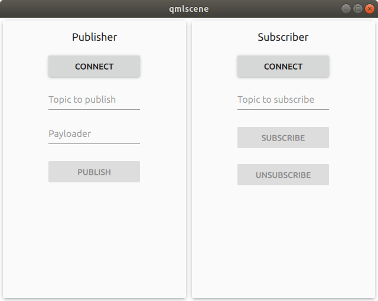

Copyright (C) Luxoft Sweden AB 2018 
<br>

## Mqtt Qt plugin

## Dependencies

To compile the plugin the mosquitto library is required. For example in Ubuntu it can be install as:
```
sudo apt-get install libmosquitto-dev libmosquitto1
```

## API

### Properties

- **clientId** : *string* - Client's identifier value
- **hostname** : *string* - A hostname of the MQTT broker to connect to
- **caCertificates** : *url* - A path to ca certificates
- **localCertificate** : *url* - A path to a local certificate
- **privateKey** : *url* - A path to the client's private key
- **port** : *int* - A port for the connection. Use 8883 for an encrypted connection, otherwise 1883 (by default)
- **keepAlive** : *int* - A ping interval in seconds
- **protocolVersion** : *enumeration ProtocolVersion* - A protocol version of the MQTT standard to use during communication with the broker
- **state** : *enumeration ClientState* - Current connection state
- **username** : *string* - A username if required
- **password** : *string* - A password if required
- **willQos** : *int* - The level of QoS for sending and storing the Will Message
- **willTopic** : *string* - A will topic
- **willMessage** : *ArrayBuffer* - The payload of a Will Message
- **willRetain** : *bool* - If Will Message should be retained on the broker for future subscribers to receive
- **errorString** : *string* - A current error description
- **error** : *enumeration ErrorType* - A current error code
- **cleanSession** : *bool* - The broker is instructed to clean all messages and subscriptions on disconnect
- **keyfilePassword** : *string* - A password to decrypt the keyfile

### Enums
- **ProtocolVersion** - The protocol version of the MQTT standard which is used to communicate with the broker
	- MQTT_3_1 = 3 - MQTT Standard 3.1
	- MQTT_3_1_1 = 4 - MQTT Standard 3.1.1, publicly referred to as version 4

- **ClientState** - The client current connection status
      - Disconnected = 0 - The client is disconnected from the broker
      - Connecting - The client is connecting to the broker
      - Connected - The client is connected to the broker

- **ErrorType** - Error type
	- ERR_SUCCESS - success, no error
	- ERR_NOMEM - out of memory condition occurred
	- ERR_PROTOCOL - a protocol error communicating with the broker
	- ERR_INVAL - the input parameters were invalid
	- ERR_NO_CONN - the client isn't connected to a broker
	- ERR_CONN_REFUSED - broker is unavailable
	- ERR_NOT_FOUND - the certificate was not found
	- ERR_CONN_LOST - the connection to the broker was lost
	- ERR_TLS - tls configuration was invalid
	- ERR_PAYLOAD_SIZE -length of the payload is too large.
	- ERR_NOT_SUPPORTED - thread support is not available
	- ERR_UNKNOWN - unknown error
    
### Methods

- *void* **connect()** - Connect the Qml client
- *void* **disconnect()** - Disconnect the Qml client
- *int* **publish(** *string* topic, *var* payload, *int* qos, *bool* retain **)** - Publish a message:
	- topic - a topic to publish
	- payload - a payload of the message to publish
	- qos - a quality of service level: 0, 1 or 2
	- retain - a message is retained on the broker
	The function returns a message id.
- *void* **subscribe(** *string* topic, *int* qos **)** - Subscribe from a topic
	- topic - a topic to subscirbe
	- qos - a quality of service level: 0, 1 or 2
- *void* **unsubscribe(** *string* topic **)** - Unsubscribe from a topic
	- topic - a topic to unsubscribe

### Signals
- **messageReceived(** *string* topic, *ArrayBuffer* payload, *int* qoS, *bool* retain **)** - The client has received a message
- **subscribed()** - A topic has been subscribed
- **published(** *int* messageId **)** - A topic has been published
- **unsubscribed()** - A topic has been unsubscribed

### Usage

The minimum set of properties which must be set in QML looks like this:

```qml
import mqttclient 1.0

Item {
    id: root
    
    MosquittoClient {
        id: mosquittoClient
        clientId: "ClientId"
        hostname: "mosquitto.server.com"
    }

    Component.OnComplete: mosquittoClient.connect()
}
```

By calling the function connect() it will make your client connect to the remote server `mosquitto.server.com:1883`. If the client succeeds to connect, its property `state` will be changed from `ClientState.Disconnected` to `ClientState.Connected`, otherwise the property `error` is set to a certain value and `errorString` will describe the error. If we want to subscribe to a certain topic

```qml
import mqttclient 1.0

Item {
    id: root
    
    MosquittoClient {
        id: mosquittoClient
        clientId: "ClientId"
        hostname: "mosquitto.server.com"
        onStateChanged: {
            if (state === ClientState.Connected) {
                mosquittoClient.subscribe("topic/test", 0)
            }
        }
    }
    
    ...
    function sendData() {
        mosquittoClient.pubish("engine/temp", engine.temperature, 0, false)
    }
    
    ...

    Component.OnComplete: mosquittoClient.connect()
}
```

The plugin contains a small test QML application which shows an example of interaction client-server.  


It's two independent clients created with `MosquittoClient` and can be connected to the same MQTT server, whether it's a mosquitto server or something else.
 The file `test/MosquittoClient.qml` contains the source code of the app. One app acts as a publisher and the other one is a subscriber. Both are connected to a local MQTT server which can be a mosquitto server. Interaction between two clients can be seen by publishing and subscribing to the same topic. One clients sends data and the other one receives it.
 

### Debug

The plugin uses categorized logs - a mechanism provided by Qt. To configure categories, please, see the documentation [here](http://doc.qt.io/qt-5/qloggingcategory.html#configuring-categories). The plugin's category is `mosquitto.client`. One of the ways to see logs from the plugin is to set an environment variable `QT_LOGGING_RULES`. To enable logs from the plugin it can be set to the following value:

```
export QT_LOGGING_RULES="mosquitto.client.debug=true"
```

